## Part 1. Запуск нескольких docker-контейнеров с использованием docker compose.

### Шаг 1: Подготовка Dockerfile

Напишем Dockerfile для каждого микросервиса, которые, будут определять, как собирать образы для наших микросервисов. В каждом Dockerfile указываем базовый образ, устанавливаем зависимости, копируем исходный код и задаем команду для запуска сервиса.

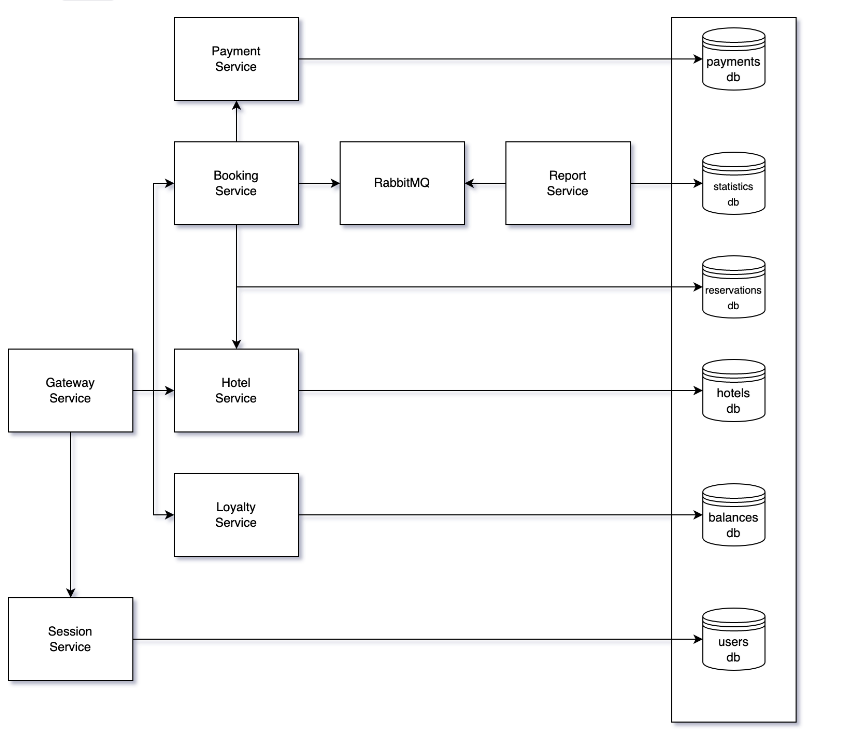

Итак, само приложение представляет из себя сервис по бронированию номеров. Вернее его backend. Состоит этот backend из девяти частей (сервисов в терминологии docker-compose):   
    1. База данных postgres.   
    2. Очередь сообщений rabbitmq.   
    3. Session service - сервис управляющий сессиями пользователей.   
    4. Hotel service - сервис управляющий сущностью отелей.   
    5. Payment service - сервис управляющий оплатой.   
    6. Loyalty service - сервис управляющий программой лояльности.   
    7. Report service - сервис осуществляющий сбор статистики.   
    8. Booking service - сервис управляющий резервированием.   
    9. Gateway service - фасад для взаимодействия с остальными микросервисами   

***Очередь сообщений RabbitMQ — это программное обеспечение для обработки сообщений, которое использует протокол AMQP (Advanced Message Queuing Protocol). Оно позволяет приложениям масштабируемо и надежно обмениваться данными. Вот основные концепции, связанные с RabbitMQ:***

* Producer (Производитель): Отправляет сообщения в очередь.
* Queue (Очередь): Хранит сообщения до тех пор, пока они не будут обработаны.
* Consumer (Потребитель): Получает сообщения из очереди и обрабатывает их.
* Exchange (Обменник): Определяет правила, по которым сообщения направляются в очереди.
* Binding (Привязка): Связывает очередь с обменником и определяет, какие сообщения должны попадать в очередь.

***RabbitMQ обеспечивает гибкость и надежность в системах, где требуется асинхронная обработка данных, распределенная обработка задач, балансировка нагрузки и отказоустойчивость***

### Шаг 2: Написание docker-compose файла 

Напишем docker-compose.yml файл, который будет осуществлять корректное взаимодействие сервисов.

### Шаг 3: Сборка образов

```sudo docker-compose build```

### Шаг 4: Запуск сервисов

```sudo docker-compose up -d```

### Шаг 5: Проверка статуса контейнеров

```sudo docker-compose ps```

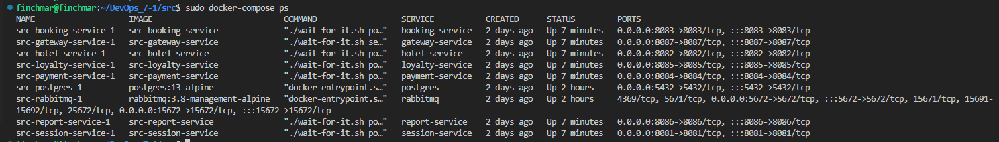

Проверяем все образы и их размеры:

```sudo docker-compose images``` 

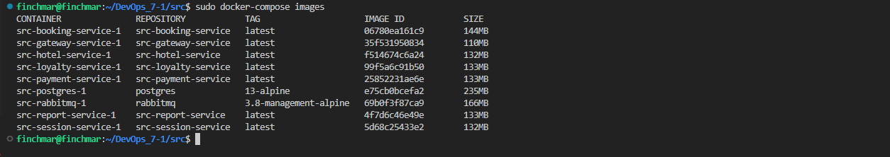 

### Шаг 6: Тестирование с помощью Postman

Прогняем уже заготовленные тесты (файл application_tests.postman_collection.json) через Postman и удостоверимся, что все они проходят успешно 

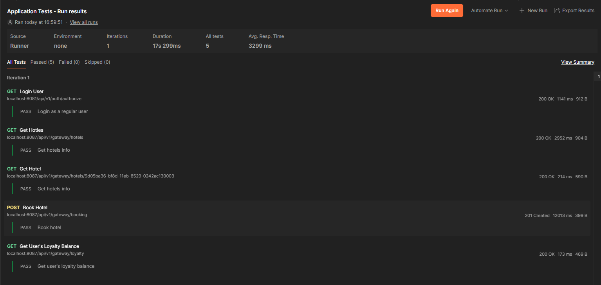

После тестирования останавливаем сервисы и очищаем ресурсы.

```sudo docker-compose down``` 


## Part 2. Создание виртуальных машин.

### Шаг 1: Установка Vagrant

Устанавливаем vagrant на Windows.  

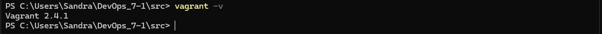

### Шаг 2: Инициализация Vagrant
```vagrant init```
### Шаг 3: Написание Vagrantfile

Редактируем созданный файл Vagrantfile, чтобы он соответствовал требованиям нашего проекта. Этот файл сконфигурирует одну виртуальную машину с операционной системой Ubuntu и выполнит синхронизацию исходного кода веб-сервиса в рабочую директорию виртуальной машины.

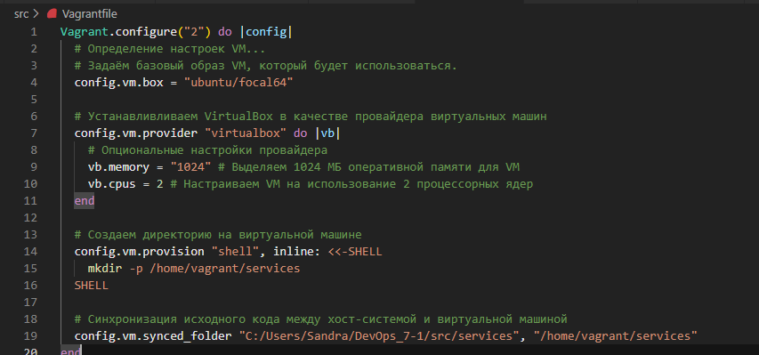

### Шаг 4: Запуск виртуальной машины

Запустим машину

```vagrant up```

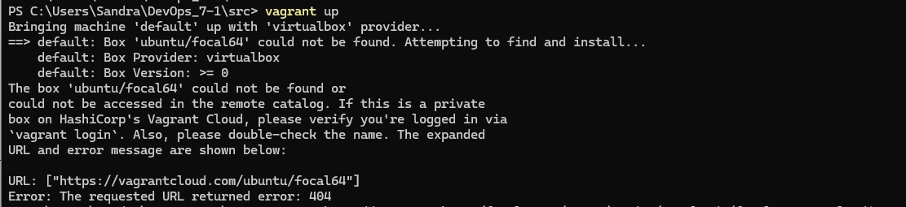

```vagrant box add --name ubuntu/focal64 C:/Users/Sandra/Downloads/focal-server-cloudimg-amd64-vagrant.box```

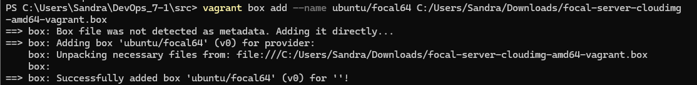

```vagrant up```

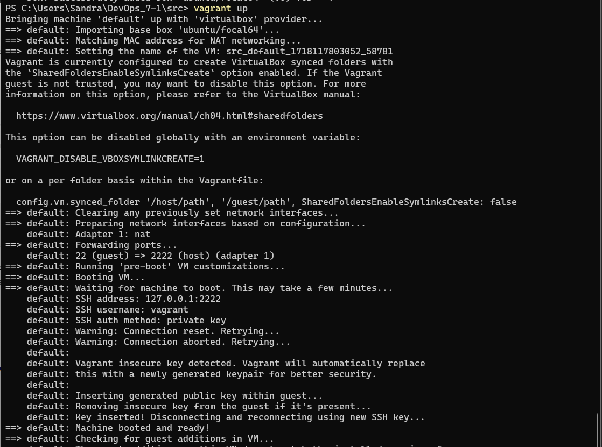
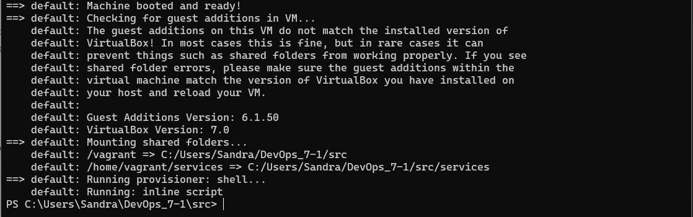

Наша виртуальная машина успешно создана и запущена. 

### Шаг 5: Подключение к виртуальной машине

Подключаемся к виртуальной машине через SSH ```vagrant ssh```

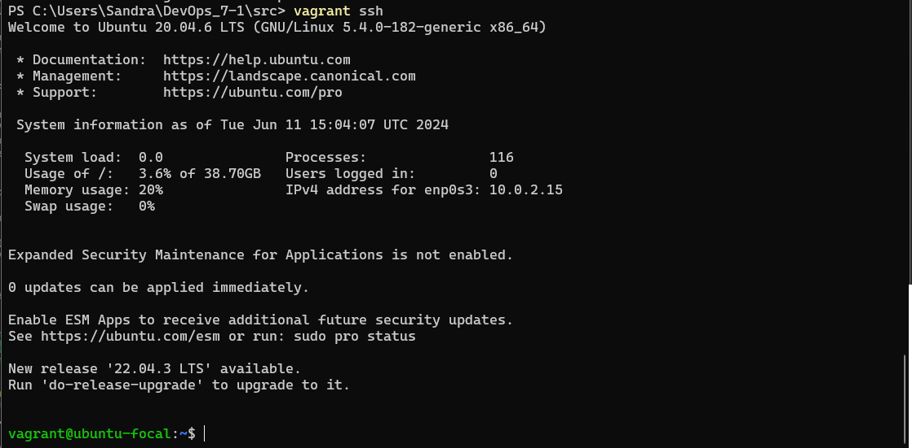

### Шаг 6: Проверка исходного кода

После подключения к виртуальной машине, проверяем, что исходный код веб-сервиса находится в рабочей директории /vagrant.

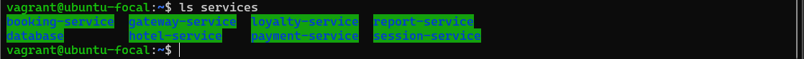

### Шаг 7: Остановка и уничтожение виртуальной машины

Выход из SSH сессии ```exit```

```vagrant status```

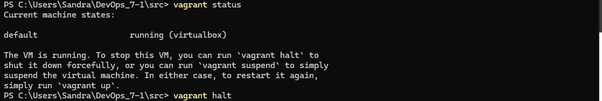

Остановливаем виртуальную машину:

```vagrant halt```

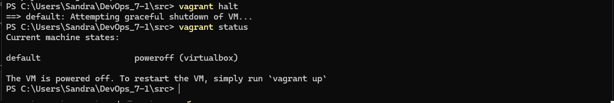

Уничтожаем виртуальную машину ```vagrant destroy```

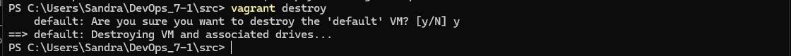


## Part 3. Создание простейшего docker swarm.

### Шаг 1: Модификация Vagrantfile

Модифицируем Vagrantfile для создания трех машин: manager01, worker01, worker02.

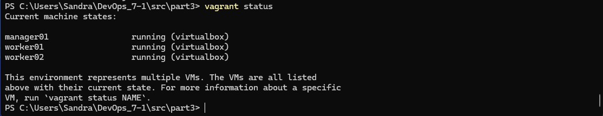

### Шаг 2: Написание shell-скрипта для установки Docker

Напишем shell-скрипты для установки docker внутрь машин, инициализации и подключения к docker swarm.  
- Для менеджера  
    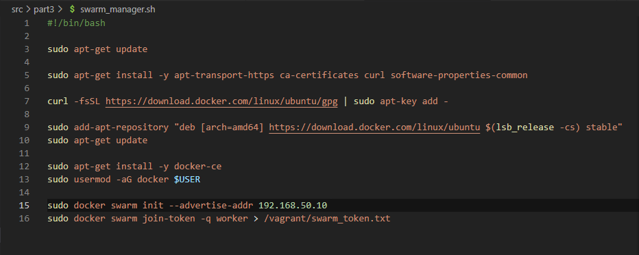
- Для воркера  
    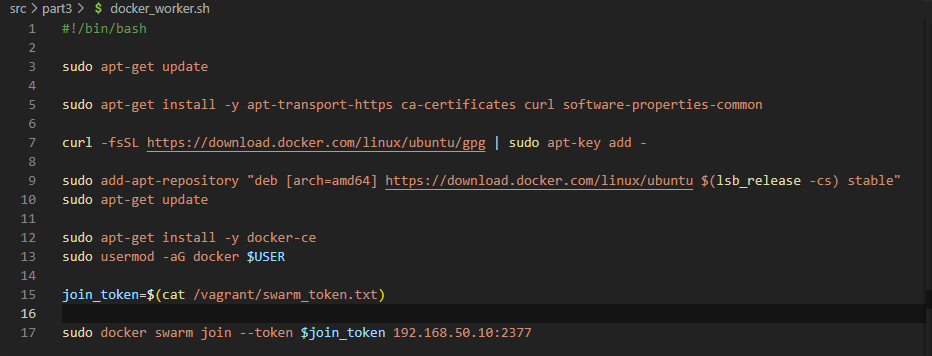

запускаем ```vagrant up``` 

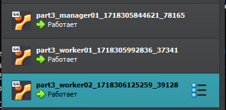

```vagrant status``` 

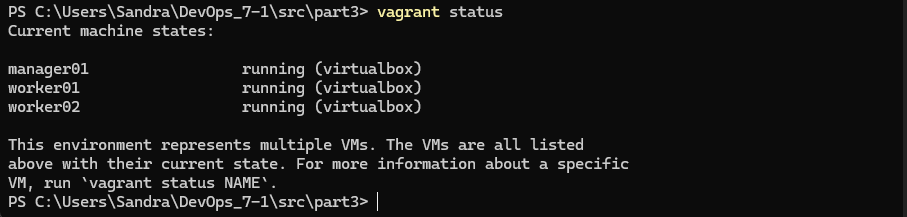

все наши машины успешно запустились

### Шаг 3:

Подключаемся к нашему менеджеру ```vagrant ssh manager01``` 

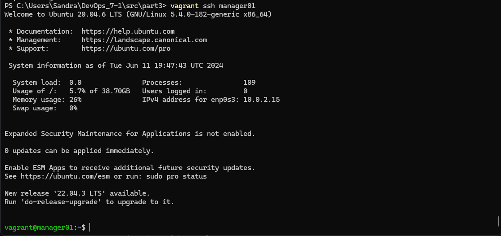

Проверяем что всё успешно завершилось ```sudo docker node ls``` 

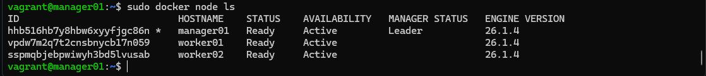

### Шаг 4: Загрузка образов на Docker Hub

Загрузим собранные образы на [docker hub](https://hub.docker.com/repositories/sandra1997bo) 

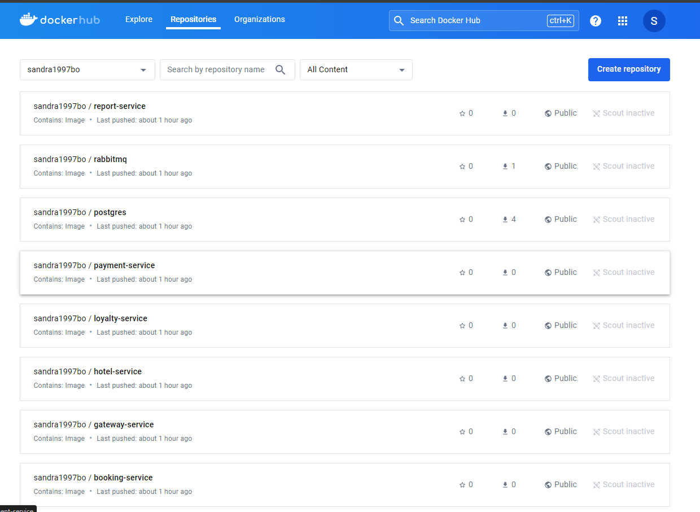

### Шаг 5: Модификация docker-compose файла

Модифицируем docker-compose.yml файл для подгрузки расположенных на docker hub образов 

### Шаг 6: Запуск стека сервисов

Запустим стек сервисов, используя написанный docker-compose файл ```sudo docker stack deploy -c docker-compose.yml MyDeploy```.

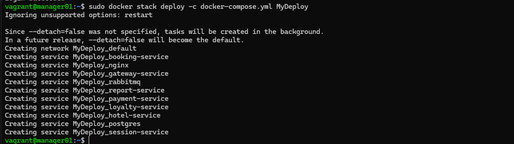

Проверяем состояние стек сервисов ```sudo docker stack services MyDeploy```

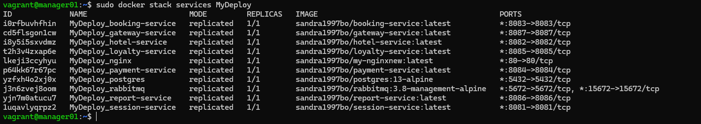

Если надо проверить логи сервиса ```sudo docker service logs <name_service>```  

Посмотреть распределение статистики сервиса ```sudo docker service ps <name_service>```

### Шаг 7: Настройка прокси на базе Nginx

Настроим прокси на базе nginx для доступа к gateway service и session service по оверлейной сети. Сами gateway service и session service сделать недоступными напрямую. И так же грузим данный образ на докер-хаб.  

Cоздадим ещё один на базе nginx. Напишем конфиги для него:  

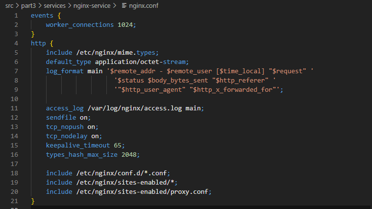
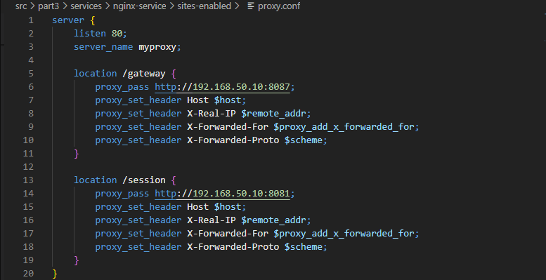

Оверлейная сеть — это виртуальная сеть, созданная поверх основной физической сети. Она позволяет соединять узлы, которые могут быть разделены различными физическими сетями, и обеспечивает дополнительный уровень абстракции для различных сетевых сервисов и протоколов1.

В контексте Docker и микросервисов, оверлейная сеть используется для обеспечения связи между контейнерами, работающими на разных хостах или в разных кластерах. Это позволяет контейнерам взаимодействовать так, как если бы они находились на одном хосте, несмотря на то, что они физически разделены.

Оверлейные сети обеспечивают множество преимуществ, таких как:

- Улучшенная безопасность: Трафик между узлами может быть зашифрован, что делает сеть более безопасной.
- Масштабируемость: Легко добавлять новые узлы и сервисы без необходимости изменения основной сетевой инфраструктуры.
- Гибкость: Можно создавать сложные топологии сети и управлять ими программно.

### Шаг 8: Тестирование с помощью Postman

Прогоним заготовленные тесты через postman и удостоверимся, что все они проходят успешно.

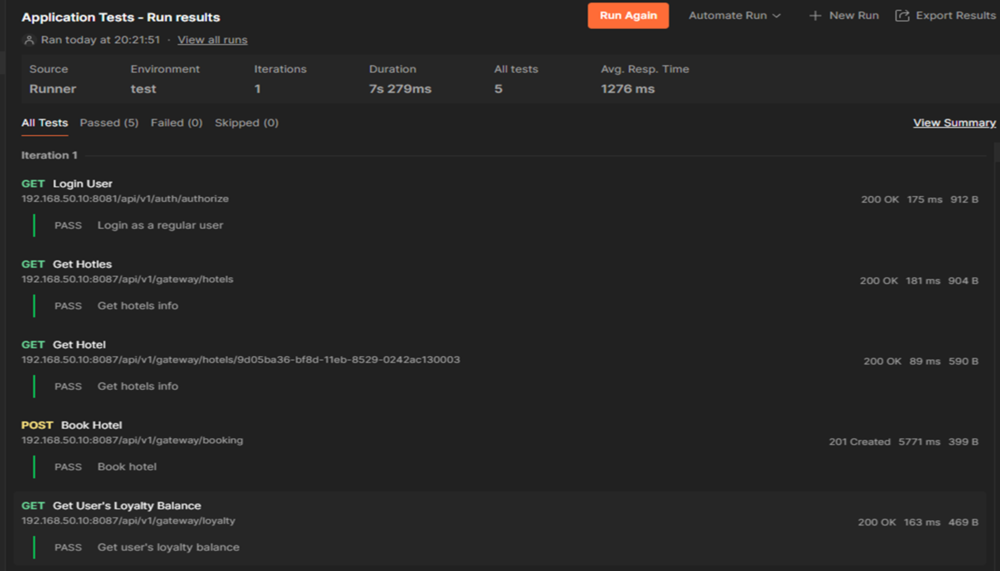

## Шаг 9: Визуализация распределения контейнеров

Используя команды docker, отобразим в отчете распределение контейнеров по узлам.  
```sudo docker node ls``` и ```sudo docker stack ps MyDeploy```  

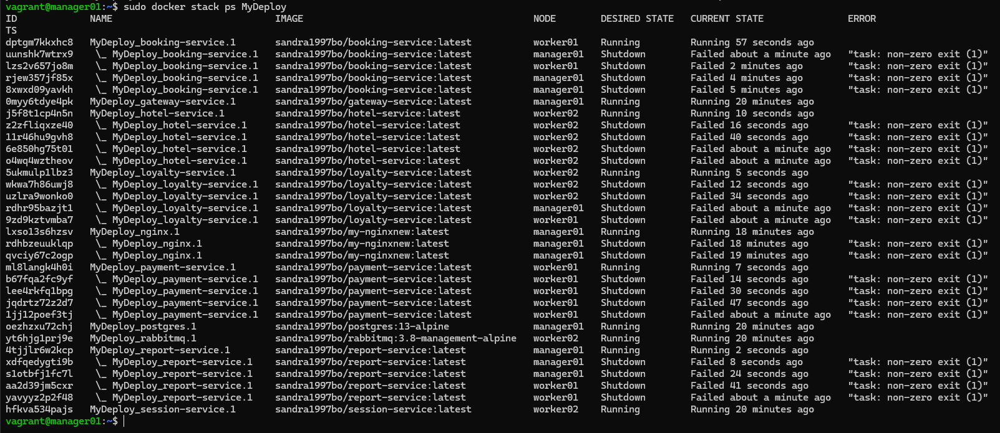

### Шаг 10: Установка Portainer

Создадим portainer-stack.yml файл для настройки portainer. Запустим стек portainer ```sudo docker stack deploy -c portainer-stack.yml portainer```

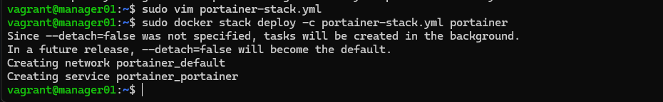

Теперь у нас есть работающий Docker Swarm кластер с настроенным прокси и Portainer для визуализации.

```sudo docker service ls```

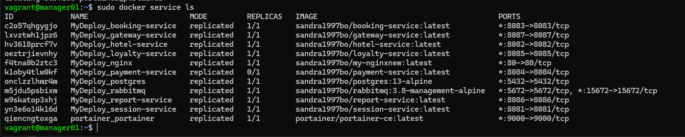

Получим доступ по адресу http://192.168.50.10:9000 для входа в portainer. 

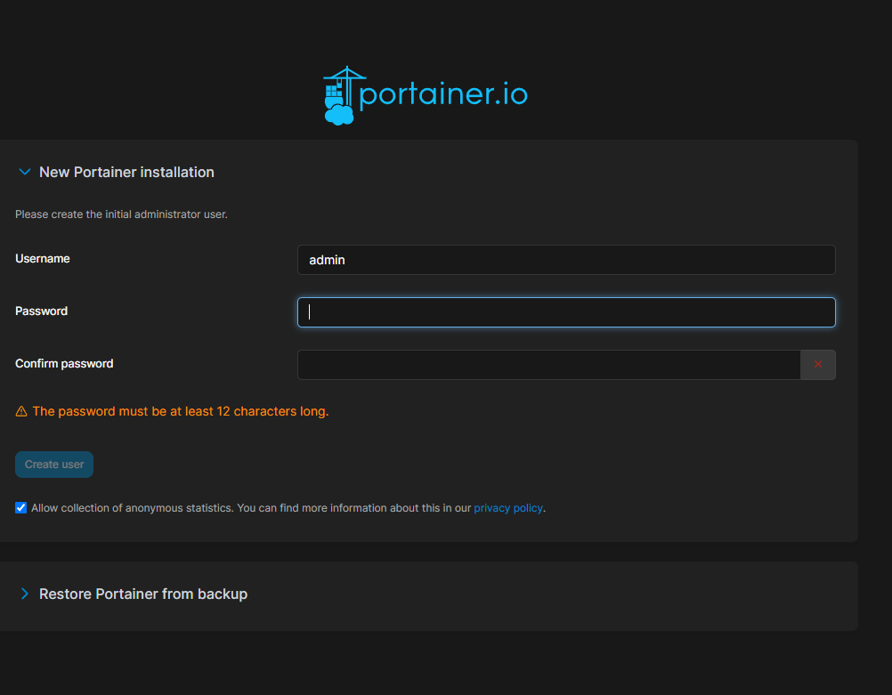

После создания пользователя, отобразятся наши сервисы

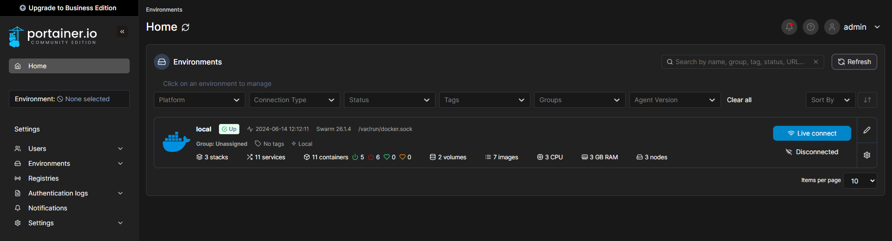

Отобразим визуализацию распределения задач по узлам.

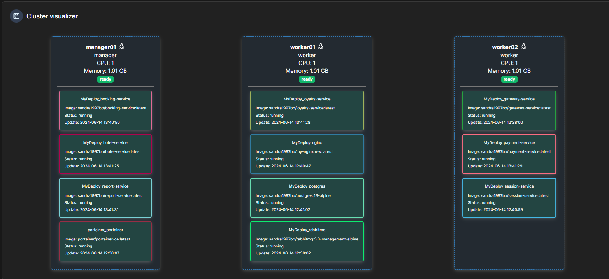
